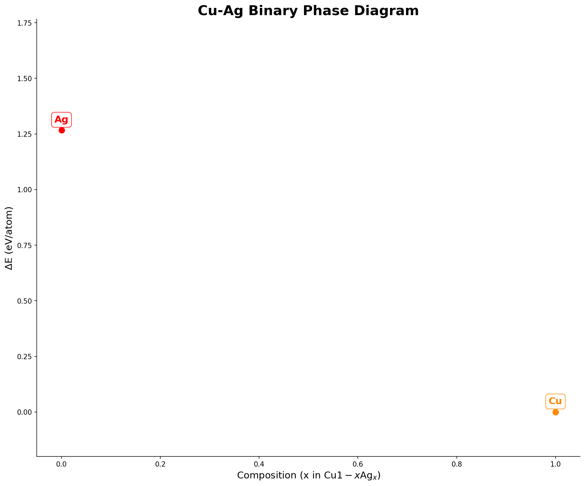
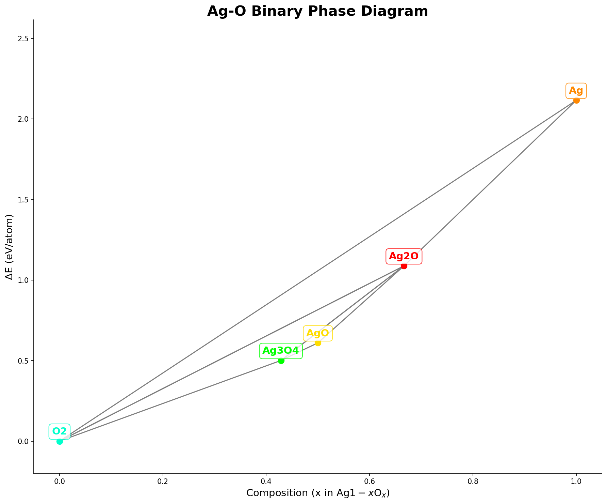
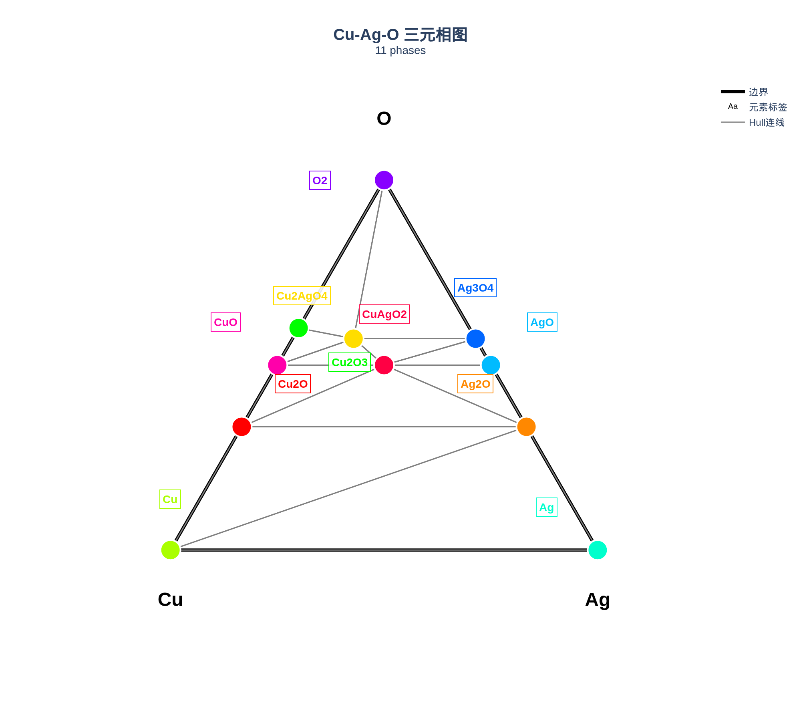
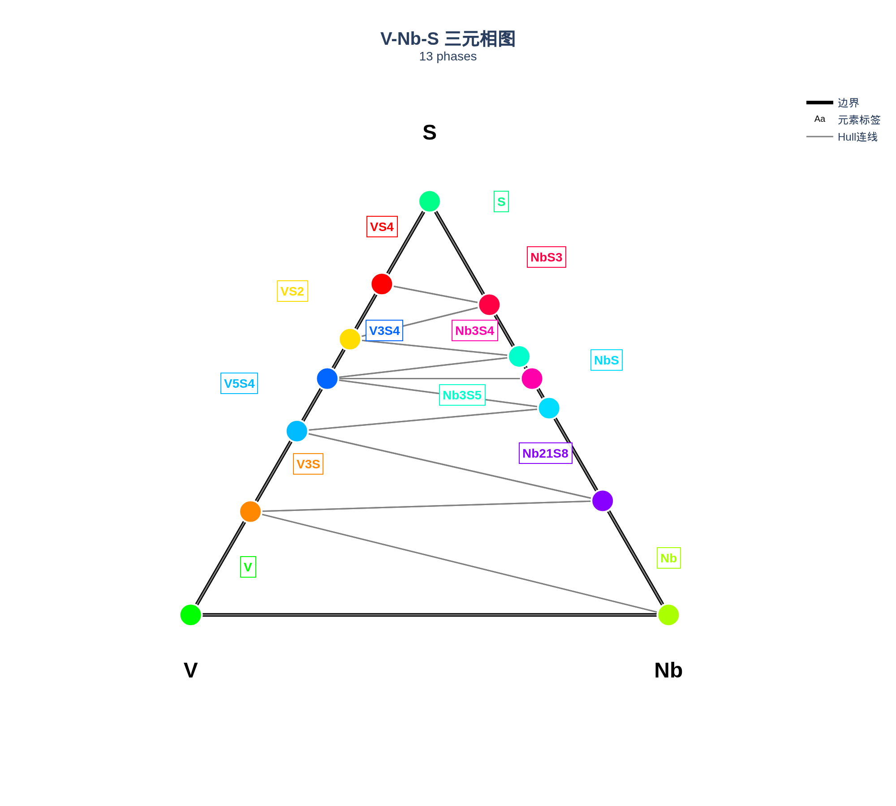
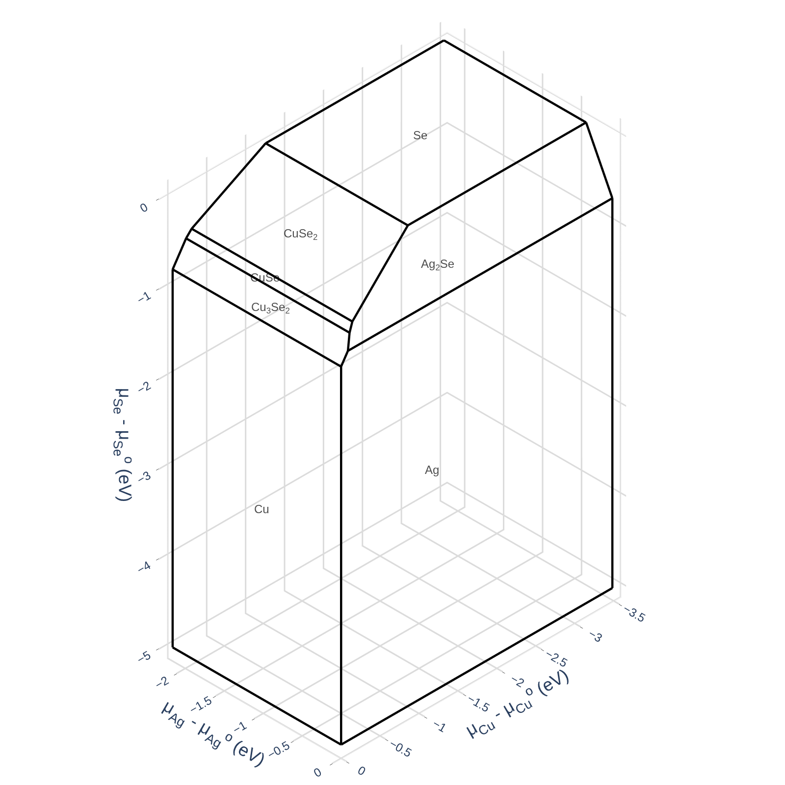
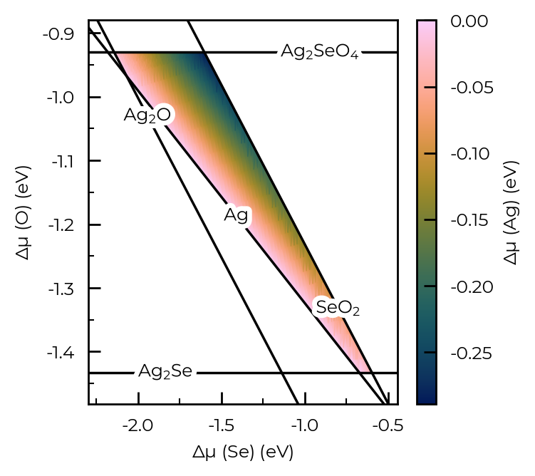

# 🚀 chemphase 正式发布！一行命令生成高质量相图，支持 Materials Project + 本地 VASP 数据

> 从三元 Gibbs 三角图到化学势热图，从 API 一键下载到本地 VASP 数据解析，chemphase 让材料相图分析从未如此简单。

---

## 为什么需要 chemphase？

在材料科学和固态化学研究中，**相图（Phase Diagram）** 是理解材料热力学稳定性的基石。无论是寻找新型功能材料、分析缺陷化学环境，还是预测合成路径，一张清晰准确的相图至关重要。

然而，生成一张专业的相图通常需要：

- 手动从 Materials Project 下载数据 🔽
- 编写 pymatgen 脚本处理热力学条目 🐍
- 处理坐标变换、标签避让、Hull 连线等可视化细节 📐
- 对比本地 VASP 计算与数据库结果的差异 🔬

**chemphase 将这一切压缩为一句话：**

```bash
pip install chemphase
chemphase --elements Li O Co
```

---

## 什么是 chemphase？

[chemphase](https://github.com/icezze/chemphase) 是一个基于 Python 的**相图与化学势热图统一生成器**，核心功能包括：

| 功能 | 说明 |
|------|------|
| 🔌 **API 模式** | 从 [Materials Project](https://materialsproject.org) 数据库自动下载热力学数据 |
| 💻 **本地模式** | 读取本地 VASP 计算目录（POSCAR + vasprun.xml/OUTCAR） |
| 🔀 **混合模式** | 本地数据 + API 补充，自动去重合并 |
| 📈 **二元相图** | ΔE vs 成分图，含 Hull 凸包连线、自动标签避让 |
| 🔺 **三元相图** | Gibbs 三角图（Plotly 交互式），含 Delaunay 三角剖分 Hull |
| 🗺️ **化学势热图** | 元素化学势空间中的稳定域可视化 |
| ⚖️ **结构对比** | 自动对比本地计算结果与 MP 数据库晶体结构差异 |

---

## 一分钟上手

### 安装

```bash
pip install chemphase
```

需要 Python 3.10+。依赖自动安装：pymatgen、doped、matplotlib、numpy、scipy、plotly。

### API 模式（默认）

无需任何本地数据，直接生成相图：

```bash
# 默认体系 Cu-Ag-O-Se（四元）
chemphase

# 指定元素
chemphase --elements Li O Co

# 调整 Energy above Hull 阈值
chemphase --elements Cu Ag O Se --eah 0.1
```

API 模式需要 [Materials Project API 密钥](https://materialsproject.org/api)：

```bash
export MATERIALS_PROJECT_API_KEY=你的密钥
```

### 本地 VASP 数据模式

如果你有自己跑的 VASP 计算结果：

```bash
chemphase --local ./my_vasp_calculations --elements Cu Ag O Se
```

会自动扫描目录，解析 vasprun.xml/OUTCAR 能量和 POSCAR 结构，构建相图。

### 结构对比模式

对比本地计算与 Materials Project 数据库的结构差异：

```bash
chemphase --local ./my_vasp_calculations --elements Cu Ag O Se --compare-structure
```

---

## 输出预览

### 二元成分相图

展示 ΔE（相对于 Hull 的能量）随成分变化的关系。Hull 连线通过 Delaunay 三角剖分自动生成，标签使用碰撞检测算法自动避让。



> 二元相图 Cu-Ag 体系：横轴为成分，纵轴为 ΔE (eV/atom)。Hull 上的点（ΔE≈0）表示热力学稳定相。

### 更多二元相图

chemphase 支持任意二元体系，自动从 Materials Project 数据库获取所有已知相：



> 二元相图 Ag-O 体系：展示了银氧化物的热力学稳定性。Ag₂O、AgO 等稳定相位于 Hull 连线底部。

### 三元成分相图

Gibbs 三角图是材料科学中最经典的可视化方式。每个点代表一个稳定相，位置由三种元素的摩尔分数决定。Hull 连线通过 Delaunay 三角剖分连接共存相。



> 三元相图 Cu-Ag-O：展示了 Cu-Ag-O 体系中的所有稳定相及其共存关系。标签使用自适应碰撞检测自动避让。

### 更复杂的三元体系



> 三元相图 V-Nb-S：V-Nb-S 体系包含多种三元化合物相，Delauay 三角剖分清晰展示了各相之间的共存关系。

### 四元体系

chemphase 还支持四元及以上的多元素体系分析：



> 四元体系 Cu-Ag-O-Se：展示了四个元素的所有二元和三元子系统的综合分析。

### 化学势热图

化学势热图展示了在给定化学势空间中，各相的稳定区域。这对于分析缺陷形成能和掺杂条件尤其重要。



> 化学势热图：展示了 Ag₂SeO₃ 相在化学势空间中的稳定域（红色/橙色区域）。

---

## 技术亮点

### 1. 智能标签避让算法

三元 Gibbs 三角图中，chemphase 实现了**自适应碰撞检测标签定位**：

- 对每个相尝试 8 个候选位置（左上、右上、左下、右下、中左、中右、上中、下中）
- 计算与已放置标签的最小距离
- 选择距离最大的位置放置标签
- 确保标签之间不重叠、不超出图表边界

### 2. Delaunay 三角剖分 Hull 连线

Hull 连线不是简单的手动连接，而是通过 **Delaunay 三角剖分** 自动计算：
- 对所有稳定相点进行三角剖分
- 自动识别共存相之间的连线
- 准确反映多相平衡关系

### 3. 统一相数据库

chemphase 内置**统一相数据库**（`unified_phases/`），自动去重合并：
- 同一相的不同结构变体自动识别
- 跨体系下载避免重复调用 API
- JSON 格式易于扩展和共享

### 4. 三模式无缝切换

| 模式 | 数据来源 | 适用场景 |
|------|----------|----------|
| API | Materials Project | 快速探索未知体系 |
| LOCAL | VASP 计算 | 高精度自有数据 |
| MIXED | API + LOCAL | 补充缺失相 |

---

## 命令行参数完整列表

```
usage: chemphase [-h] [--local LOCAL] [--elements ELEMENTS [ELEMENTS ...]]
                 [--output OUTPUT] [--eah EAH] [--compare-structure] [--debug]

参数说明:
  --local LOCAL          本地 VASP 计算结果目录路径
  --elements ELEMENTS    目标元素列表（如 Cu Ag O Se）
  --output OUTPUT        输出目录（默认: phase_diagrams_output）
  --eah EAH              Energy above hull 阈值 (默认: 0.05 eV/atom)
  --compare-structure    启用本地结构 vs MP 数据库对比
  --debug                调试模式，输出详细信息
```

---

## 安装与依赖

```bash
pip install chemphase
```

**核心依赖**（自动安装）：

| 库 | 最低版本 | 用途 |
|----|----------|------|
| pymatgen | ≥2023.0.0 | 材料学核心库，处理晶体结构、相图计算 |
| doped | ≥3.2.0 | 缺陷计算扩展库 |
| matplotlib | ≥3.5.0 | 二元相图与化学势热图渲染 |
| plotly | ≥5.0.0 | 三元相图交互式可视化 |
| numpy | ≥1.21.0 | 数值计算 |
| scipy | ≥1.7.0 | Delaunay 三角剖分 |

---

## 应用场景

### 🧪 学术研究

- **新型材料发现**：快速筛查多元素体系的热力学稳定相
- **缺陷物理**：化学势热图确定缺陷形成能的化学势窗口
- **合成路径设计**：通过相图预测前驱体和中间相

### 🏭 工业应用

- **合金设计**：多组元合金的相稳定性分析
- **半导体掺杂**：掺杂剂的化学势边界条件
- **电池材料**：电极材料的相稳定性和分解路径

### 📚 教学用途

- **材料热力学课程**：直观展示 Gibbs 相律和相平衡
- **DFT 计算教学**：连接第一性原理计算与热力学分析

---

## 开源与社区

- 🔗 **GitHub**: [https://github.com/icezze/chemphase](https://github.com/icezze/chemphase)
- 📦 **PyPI**: [https://pypi.org/project/chemphase/](https://pypi.org/project/chemphase/)
- 📖 **完整示例数据**: GitHub 仓库 `examples/` 目录包含 Cu-Ag-O-Se 和 V-Nb-S 体系的完整相图输出及统一相数据库
- 🐛 **问题反馈**: [GitHub Issues](https://github.com/icezze/chemphase/issues)
- 📄 **许可证**: MIT License

### 参与贡献

欢迎提交 Pull Request！无论是新功能、Bug 修复还是文档改进，所有贡献都会在 README 中致谢。

```bash
git clone https://github.com/icezze/chemphase.git
cd chemphase
pip install -e ".[dev]"
pytest tests/ -v
```

---

## 展望

chemphase 的下一个里程碑：

- [ ] **Web 界面**：基于 Streamlit 的交互式 Web 应用
- [ ] **更多相图类型**：Eh-pH (Pourbaix) 图、Grand potential 相图
- [ ] **缺陷形成能集成**：与 doped/UDA 缺陷分析管线深度整合
- [ ] **AI 辅助相预测**：基于机器学习的未知相稳定性预测

---

## 立即体验

```bash
pip install chemphase
chemphase --elements Cu Ag O Se
```

从安装到第一张相图，只需 **30 秒**。

如果在使用中遇到任何问题，欢迎在 [GitHub Issues](https://github.com/icezze/chemphase/issues) 提出，或直接在我们的讨论区交流！

---

> **chemphase** — 让相图分析像 `pip install` 一样简单 ✨

*Powered by [pymatgen](https://pymatgen.org) + [doped](https://github.com/SMTG-Bham/doped) + [Materials Project](https://materialsproject.org)*